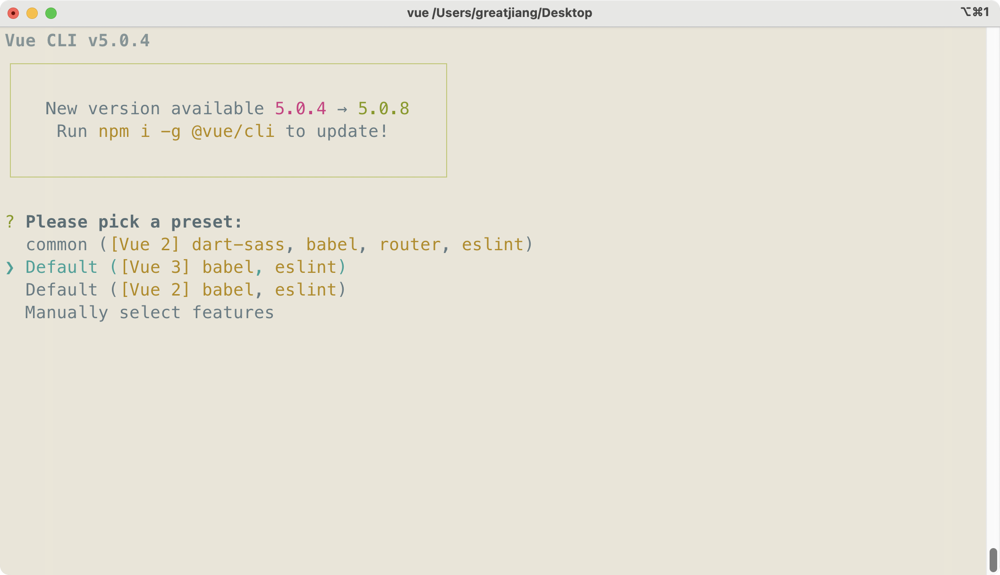
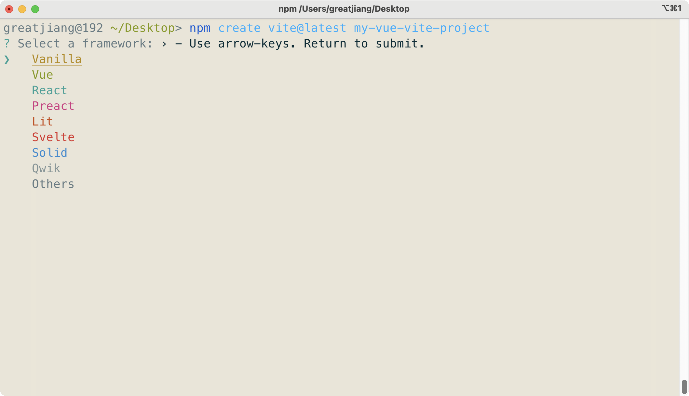

# Vue项目必备知识
1. 创建项目
2. 数据管理
3. 路由管理
4. 组件开发
5. Axios使用
6. 配置代理
7. 插件和库的使用

## 1.创建项目

### 1.使用Vue CLI方式
安装 Vue CLI：  
```sh
npm install -g @vue/cli
```

创建项目：  
```sh
vue create my-vue-project
```

操作界面：  
  

如何查看当前vue-cli版本？  
```sh
vue --version
```
或
```sh
vue -V
```

Vue CLI脚手架使用的是Webpack打包工具。   

### 2.使用Vite 方式
创建项目：  
```sh
npm create vite@latest my-vue-project
```

操作界面：  
  

查看vite版本：
```sh
vite --version
```
或
```sh
vite -v
```

### 3. 使用 npm init vue@latest
```sh
npm init vue@latest
```
使用的是Vite构建工具。   

## 2.数据管理
Vuex   
Pinia

## 3.路由管理
安装路由  
静态路由  
动态路由  
路由守卫  
装载路由  
路由模式  
路由命名  
路由参数  
处理404页面  
路由懒加载  

## 4.组件开发
[Vue3组件库开发教程](../../../projects/vue3-components.md)
## 5.Axios配置
安装vue-axios  
自定义配置  
不同数据格式的处理  
响应拦截：未登录处理等  
## 6.配置代理
以Vite项目为例：  
在vite.config.js中配置  
```js
server: {
  proxy: {
    '/api': {
      target:'http://localhost:3000',
      rewrite: (path) => path.replace(/^\/api/, ''),
    }

  }
}
```
## 7.插件和库的使用
